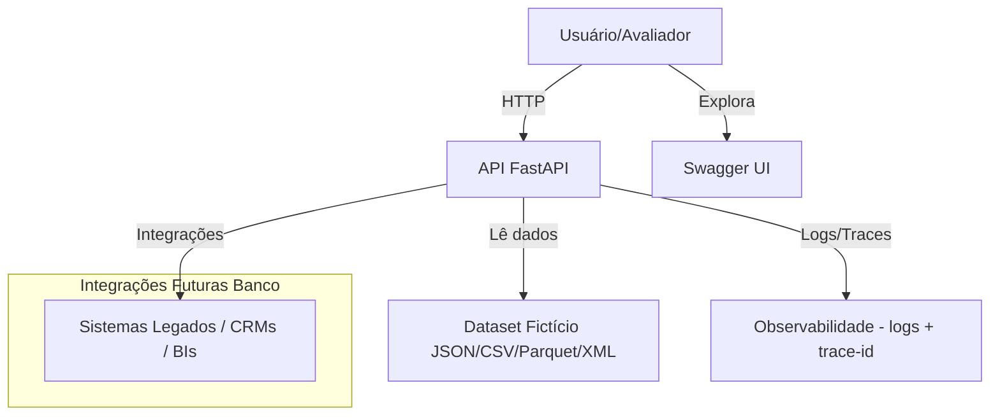
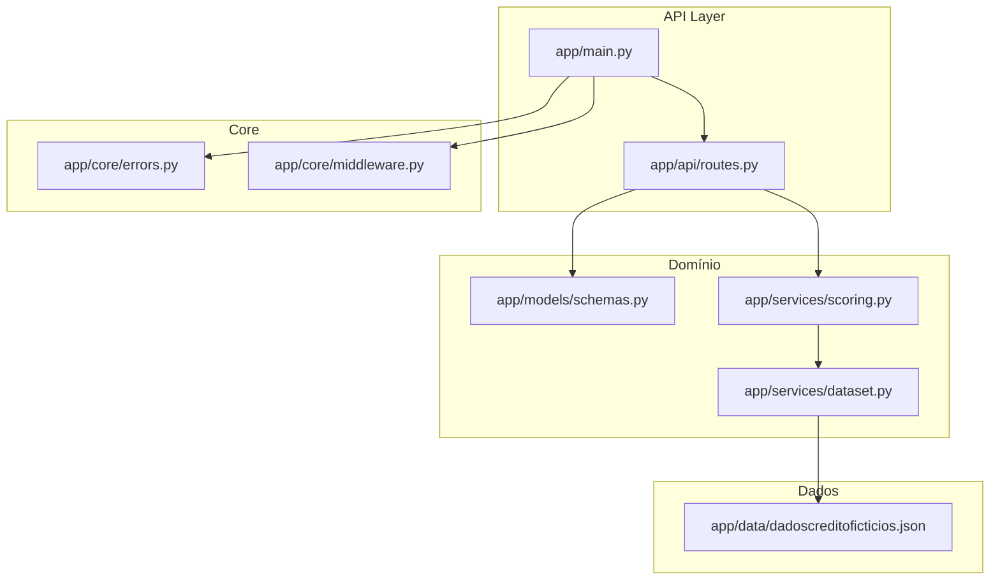
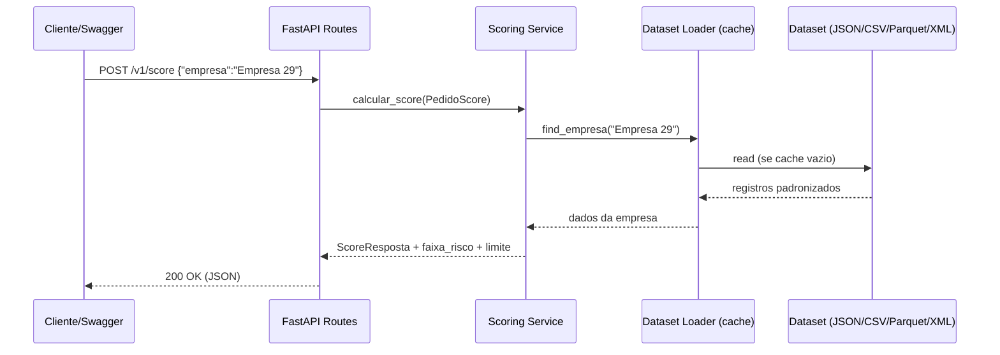
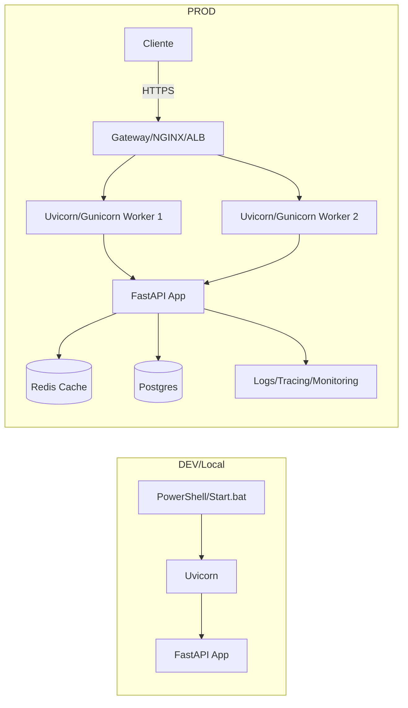

# Crédito PME API (FastAPI) 🚀

API para simular **score**, **limite sugerido** e **motivos explicativos** para pequenas e médias empresas (PME), usando os dados fictícios fornecidos no desafio.

---

## 📑 Sumário
- [Como rodar](#-como-rodar)
- [Configuração (.env)](#-configuração-env)
- [Endpoints](#-endpoints)
- [Exemplos de requisição](#-exemplos-de-requisição)
- [Estrutura do projeto](#-estrutura-do-projeto)
- [Testes](#-testes)
- [Dicas (PyCharm)](#-dicas-pycharm)
- [Licença](#-licença)

---

## ✅ Como rodar

### Opção A — com 2 cliques (recomendada)

**Primeira vez (instalar dependências):**
```powershell
cd C:\Users\junin\credito-pme
python -m venv .venv
.\.venv\Scripts\Activate.ps1
pip install -r requirements.txt
```

Depois (sempre): dê duplo clique em start.bat.

Acesse:

Swagger: http://127.0.0.1:8001/docs

Healthcheck: http://127.0.0.1:8001/healthz

Opção B — manual (PowerShell)
```powershell
cd C:\Users\junin\credito-pme
.\.venv\Scripts\Activate.ps1
uvicorn app.main:app --reload --port 8001
```
🔧 Configuração (.env)

O projeto lê variáveis via python-dotenv.

Exemplo (.env.example → .env):
```powershell
APP_NAME="Crédito PME API (DEV)"
```

🔗 Endpoints
```powershell
Método	                Rota	                          Descrição
GET	                  /healthz	                    Healthcheck simples
POST	                /v1/score	               Calcula score e limite sugerido
POST	            /v1/score/motivos	          Mesmo cálculo + lista de motivos
```
Request base (JSON)
```powershell
{
  "empresa": "Empresa 29"
}
```
👉 Você pode mandar apenas o nome da empresa (a API completa os dados pelo dataset do desafio)
ou enviar todos os campos manualmente:
```powershell
{
  "empresa": "Empresa 90",
  "receita_anual": 926500,
  "divida_total": 286405,
  "prazo_pagamento_dias": 98,
  "setor": "Educação",
  "rating": "D",
  "noticias_recentes": "Oportunidades de parcerias surgindo."
}
```
Response /v1/score (200)
```powershell
{
  "empresa": "Empresa 29",
  "score": 894,
  "limite_sugerido": 275921,
  "faixa_risco": "baixíssimo"
}
```

Response /v1/score/motivos (200)
```powershell
{
  "empresa": "Empresa 29",
  "motivos": [
    "Dados preenchidos a partir do dataset do desafio.",
    "Endividamento/Receita saudável (até 50%).",
    "Rating A+ favorece aprovação.",
    "Setor 'Tecnologia' tradicionalmente resiliente no modelo.",
    "Notícia recente positiva."
  ]
}
```
<details> <summary><b>Notas de cálculo</b></summary>

Base do score vem do Rating (ex.: A+, B, C...).

Ajustes por setor, prazo de pagamento e notícias recentes.

Penalidade forte por endividamento (dívida/receita).

Score limitado entre 300–900.

Faixa de risco: baixíssimo / baixo / médio / alto / altíssimo.

Limite sugerido = fração da receita anual ajustada pelo rating e pelo endividamento.

</details>

🧪 Exemplos de requisição

PowerShell (Invoke-RestMethod)
```powershell
$body = @{ empresa = "Empresa 29" } | ConvertTo-Json
Invoke-RestMethod -Uri "http://127.0.0.1:8001/v1/score" -Method POST -Body $body -ContentType "application/json"
Invoke-RestMethod -Uri "http://127.0.0.1:8001/v1/score/motivos" -Method POST -Body $body -ContentType "application/json"
```
curl (Windows PowerShell exige aspas escapadas):
```powershell
curl -X POST "http://127.0.0.1:8001/v1/score" -H "Content-Type: application/json" -d "{\"empresa\":\"Empresa 29\"}"
```

🗂 Estrutura do projeto
```powershell
credito-pme/
├─ app/
│  ├─ api/
│  │  ├─ __init__.py
│  │  └─ routes.py           # Rotas /v1/score e /v1/score/motivos
│  ├─ core/
│  │  ├─ __init__.py
│  │  ├─ errors.py           # Handlers globais de erro + resposta padrão
│  │  └─ middleware.py       # CORS, Trace-ID, timing
│  ├─ models/
│  │  ├─ __init__.py
│  │  └─ schemas.py          # PedidoScore, ScoreResposta, MotivosResposta
│  ├─ services/
│  │  ├─ __init__.py
│  │  ├─ dataset.py          # Carrega dataset fictício (JSON/CSV/Parquet/XML)
│  │  └─ scoring.py          # Lógica de score, limite e motivos
│  ├─ data/
│  │  └─ dadoscreditoficticios.json
│  └─ main.py                # Cria app e inclui rotas/middlewares
├─ tests/
│  └─ test_api.py            # Testes básicos com pytest
├─ .env.example
├─ .gitignore
├─ README.md
├─ requirements.txt
└─ start.bat
```

🧪 Testes
```powershell
cd C:\Users\junin\credito-pme
.\.venv\Scripts\Activate.ps1
pytest -q
```
Saída esperada:
```powershell
6 passed
```

💡 Dicas (PyCharm)

Run/Debug: crie uma configuração do tipo Python > Module name: uvicorn, parâmetros:
```powershell
app.main:app --reload --port 8001
```
Marque a pasta app como Sources Root (botão direito > Mark Directory As > Sources Root) para evitar pastas vermelhas.

📜 Licença

Projeto desenvolvido para fins educacionais e de avaliação técnica.  
Uso livre para estudo e demonstração.


## 🧭 Desenho da Arquitetura

### Visão de Contexto



### Componentes Internos


### Fluxo de Requisição


### Topologia de Deploy (mínimo → escalável)


---

## 📋 Justificativas da Arquitetura

### 1. Análise do Problema e Requisitos
- **Funcionais**: calcular score, sugerir limite, explicar motivos, lidar com cenários ambíguos, expor via API com Swagger e healthcheck.  
- **Não funcionais**: segurança (variáveis no .env, HTTPS em produção), desempenho (cache em memória), escalabilidade (stateless, múltiplos workers), usabilidade (Swagger), robustez (tratamento de erros claros).  
- **Trade-offs**: simplicidade (dataset em arquivo) vs. escalabilidade futura (DB/Cache); regras determinísticas (explicabilidade) vs. modelos ML (maior acurácia).

### 2. Clareza e Completude da Arquitetura
- Diagramas mostram visão de contexto, componentes, fluxo de requisição e topologia de deploy.  
- Componentes bem definidos: API, core (middlewares/erros), domínio (scoring, dataset, schemas), dados (arquivos fictícios).  
- Interações claras: cliente → API → serviços → dataset → resposta.

### 3. Seleção de Tecnologias e Justificativa
- **FastAPI + Uvicorn**: performance, tipagem, docs automáticas.  
- **Pydantic v2**: validação robusta e schemas claros.  
- **Pandas/PyArrow/lxml**: leitura flexível dos formatos do desafio.  
- **pytest**: testes simples e automatizáveis.  
- **dotenv**: separação de configurações.  
- Futuro: Redis (cache compartilhado), Postgres (persistência), CI/CD no GitHub Actions.

### 4. Mitigação de Riscos e Vieses da IA
- Hoje: regras determinísticas → explicabilidade clara e sem “alucinações”.  
- Futuro: se usar LLM → aplicar RAG (buscar apenas fatos do dataset), validação humana em casos ambíguos, máscara de dados sensíveis, guardrails e monitoramento de vieses.  
- Auditoria: logs de decisão e amostragem periódica.

### 5. Escalabilidade, Manutenibilidade e Robustez
- Stateless: múltiplos workers → fácil escalar horizontalmente.  
- Healthcheck e logs estruturados com trace-id.  
- Código modular: api, services, models, core, data.  
- Fácil de evoluir: trocar dataset por banco sem mudar regras.  
- Tratamento de erros centralizado (mensagens amigáveis).

### 6. Inovação e Criatividade
- Explicabilidade nativa (motivos claros no endpoint).  
- Preparado para múltiplos formatos de dados (JSON, CSV, Parquet, XML).  
- Suporte a cenários ambíguos com justificativas equilibradas.  
- Design pronto para extensão com IA generativa (LLM + RAG).

---

## 📌 Resumo Executivo
- API de crédito PME integrada ao dataset fictício do desafio.  
- Arquitetura simples, modular e escalável.  
- Regras determinísticas com explicabilidade clara.  
- Tratamento de erros amigável e testes básicos incluídos.  
- Caminho aberto para evolução com DB, cache, CI/CD e IA generativa sob RAG.


